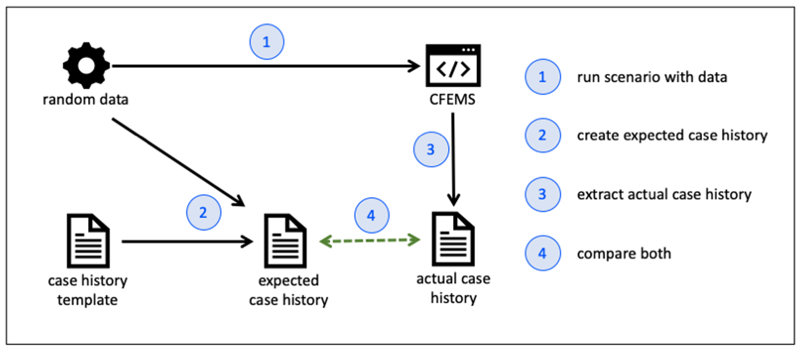

## Case History Validation



### Steps to add case history validation to a test scenario

In this example we will add case history validation to the `RITEndToEndTests.testRITCaseRerouteToComplianceAndTeamLeaderApproved` test.

1. Create a blank case history template file in `src/test/resources/templates/case-history/rit/reroute-to-compliance.txt`

1. At the end of your test scenario, load the *expected* case history template.

    ```java
    List<CaseHistoryRecord> expectedCaseHistory = new CaseHistoryLoader("rit/reroute-case.txt").load();
    ```
 
1. Get the *actual* case history from the target system.

    ```java
    List<CaseHistoryRecord> actualCaseHistory = activitiesInProgressPage.clickOnCaseHistoryTab()
           .getCaseHistory();
    ```
   
1. Add code to compare the two case histories

    ```java
    assertThat("Case history not displayed as expected", actualCaseHistory, isSameCaseHistoryAs(expectedCaseHistory));
    ```
1. Run the mvn clean command 
 
1. Run the test scenario. We would expect this to fail as the expected case history is currently loading from an empty file.
But this will give us a good base to start from.

1. After the test has executed (and failed), the actual case history will be saved to `target/case-history/RITEndToEndTests.testRITCaseRerouteToComplianceAndTeamLeaderApproved.actual`.
Copy the content into your template file `src/test/resources/templates/case-history/rit/reroute-to-compliance.txt`.

1. Go through the template file and replace all dynamically-generated data with the appropriate placeholders.
See the [applying and resolving placeholders](#placeholders) section for more details.

1. Modify the code to provide the data required to resolve the placeholders you have created in your template file.
See the [applying and resolving placeholders](#placeholders) section for more details.

    ```java
    List<CaseHistoryRecord> expectedCaseHistory = new CaseHistoryLoader("rit/reroute-case.txt")
           .withData(reRouteCaseDetails)
           .withData("CASE_WORKER", caseWorker)
           .withData("TEAM_LEADER", teamLeader)
           .load();
    ```

1. Re-run the tests again and resolve any outstanding inconsistencies between expected and actual by including and resolving placeholders in the template file.


### Applying and resolving placeholders<a name="placeholders"></a>

#### 1. Using Strings to resolve placeholders

Given a case history template file below:

```
Case Assigned | Case owner assigned to [{{FULL_NAME}}]
```

You can provide a resolve the placeholder by providing a String to the CaseHistoryLoader.

```java
List<CaseHistoryRecord> expectedCaseHistory = new CaseHistoryLoader("rit/reroute-case.txt")
           .withData("FULL_NAME", "Augustine K.")
           .load();
```

This will result in an expected case history:

```
Case Assigned | Case owner assigned to [Augustine K.]
```

#### 2. Using annotated instance variables to resolve placeholders

Given a case history template file below:

```
Case Assigned | Case owner assigned to [{{FULL_NAME}}]
```

Apply the `@CaseHistoryField` annotation an instance variable of a class that holds the data we want to use. 

```java
class User {
    @CaseHistoryField private String fullName;
    public User(String fullName) {
        this.fullName = fullName;
    }
}
```

Then provide the instance to the CaseHistoryLoader.

```java
User myUser = new User("Augustine K.")
List<CaseHistoryRecord> expectedCaseHistory = new CaseHistoryLoader("rit/reroute-case.txt")
           .withData(myUser)
           .load();
```

The instance variable name `fullName` will be converted to  snake case `FULL_NAME` resulting in an expected case history:

```
Case Assigned | Case owner assigned to [Augustine K.]
```

#### 3. Using annotated methods to resolve placeholders

Given a case history template file below:

```
Case Assigned | Case owner assigned to [{{FULL_NAME}}]
```

Apply the `@CaseHistoryField` annotation a method of a class that returns the data we want to use. 

```java
class User {
    private String firstName;
    private String lastName;

    public User(String firstName, String lastName) {
        this.firstName = firstName;
        this.lastName = lastName;
    }
    
    @CaseHistoryField
    public String getFullName() {
        return String.join(" ", firstName, lastName);
    }
}
```

Then provide the instance to the CaseHistoryLoader.

```java
User myUser = new User("Augustine", "K.")
List<CaseHistoryRecord> expectedCaseHistory = new CaseHistoryLoader("rit/reroute-case.txt")
           .withData(myUser)
           .load();
```

This will result in an expected case history:

```
Case Assigned | Case owner assigned to [Augustine K.]
```

#### 4. Using prefixes to handle duplicates

Given a case history template file below:

```
Case Assigned | Case owner assigned to [{{CASE_WORKER_FULL_NAME}}]
Case Assigned | Case approved by [{{TEAM_LEADER_FULL_NAME}}]
```

And an annotated `User` class: 

```java
class User {
    @CaseHistoryField private String fullName;
    public User(String fullName) {
        this.fullName = fullName;
    }
}
```

Then provide multiple user instances of the same class will cause a runtime exception

```java
User caseWorker = new User("Augustine", "K.")
User teamLeader = new User("John", "L.")
List<CaseHistoryRecord> expectedCaseHistory = new CaseHistoryLoader("rit/reroute-case.txt")
           .withData(caseWorker, teamLeader)
           .load(); // this will throw a Runtime Exception because multiple values for {{FULL_NAME}} were found.
```

Fix this by assigning prefixes to each instance if the same type.

```java
User caseWorker = new User("Augustine", "K.")
User teamLeader = new User("John", "L.")
List<CaseHistoryRecord> expectedCaseHistory = new CaseHistoryLoader("rit/reroute-case.txt")
           .withData("CASE_WORKER", caseWorker)
           .withData("TEAM_LEADER", teamLeader)
           .load();
```

This will result in an expected case history:

```
Case Assigned | Case owner assigned to [Augustine K.]
Case Assigned | Case approved by [John L.]
```

#### 5. Specifying the annotation name

Given a case history template file below:

```
Case Assigned | Case owner assigned to [{{CUSTOM_USER_NAME}}]
```

Apply the `@CaseHistoryField` annotation with aa specified placeholder name `CUSTOM_USER_NAME`. 

```java
class User {
    @CaseHistoryField("CUSTOM_USER_NAME") private String fullName;
    public User(String fullName) {
        this.fullName = fullName;
    }
}
```

Then provide the instance to the CaseHistoryLoader.

```java
User myUser = new User("Augustine K.")
List<CaseHistoryRecord> expectedCaseHistory = new CaseHistoryLoader("rit/reroute-case.txt")
           .withData(myUser)
           .load();
```

This will result in an expected case history:

```
Case Assigned | Case owner assigned to [Augustine K.]
```

#### 6. Using annotations from nested objects

Given a case history template file below:

```
Case Assigned | Case owner assigned to [{{CASE_WORKER_FULL_NAME}}]
Case Assigned | Case approved by [{{TEAM_LEADER_FULL_NAME}}]
```

Apply the `@CaseHistoryField` annotation nested objects of the class that holds the data we want to use. 

```java
class User {
    @CaseHistoryField private String fullName;
    public User(String fullName) {
        this.fullName = fullName;
    }
}

class UserData {
    User caseWorker = new User("Augustine K.");
    User teamLeader = new User("John L.");
}
```

Then provide the instance to the CaseHistoryLoader.

```java
UserData userData = new UserData();
List<CaseHistoryRecord> expectedCaseHistory = new CaseHistoryLoader("rit/reroute-case.txt")
           .withData(userData)
           .load();
```

This will result in an expected case history:

```
Case Assigned | Case owner assigned to [Augustine K.]
Case Assigned | Case approved by [John L.]
```


### Other features

- You can comment out a line in the expected case history template file if it does not work yet.

    ```
    // Case Assigned | Case owner assigned to [{{CASE_WORKER_FULL_NAME}}]
    Case Assigned | Case approved by [{{TEAM_LEADER_FULL_NAME}}]
    ```